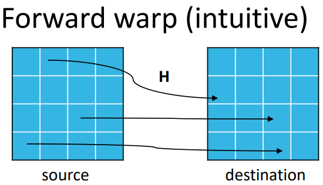
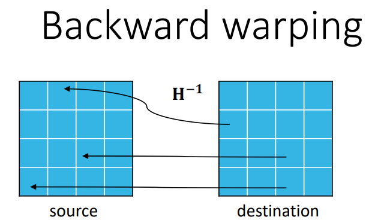
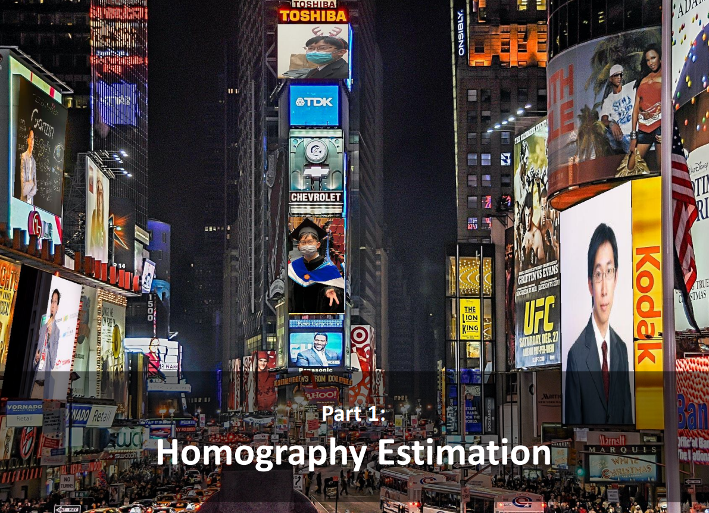
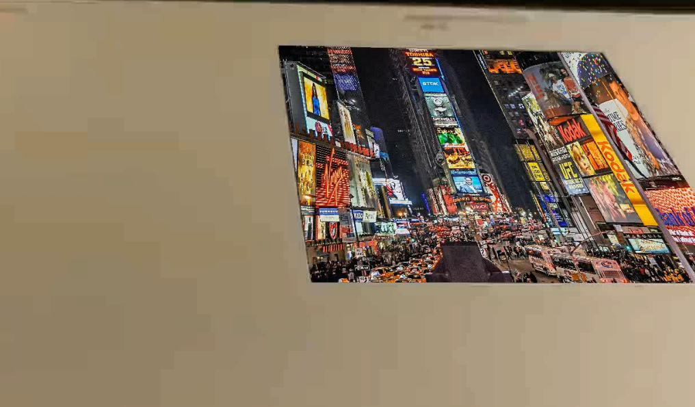
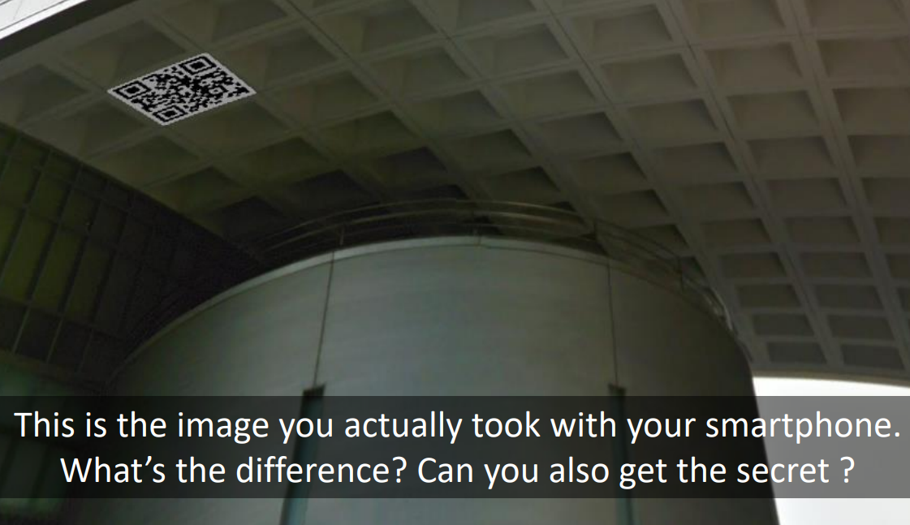
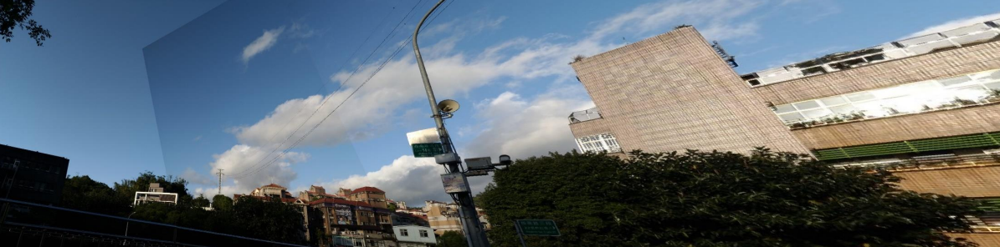

# Projective Geometry
A impletment for Homography Estimation, Marker-Based Planar AR, Unwarp the Secret and Panorama.




### Homography Estimation
Implement estimating homography and output the forward warped canvas.


### Marker-Based Planar AR
Process the given video and backward warp the template image per frame.


### Unwarp the Secret
Unwarp the QR code with backward warping, Can you get the correct QR code link from both images?


### Panorama
Implement the function panorama.


## Usage
### Requirement (prerequisite: conda)
Type the following command in your terminal, you should have conda to build the environment.

```sh
git clone https://github.com/willychen0146/Projective-Geometry.git
cd Projective-Geometry
# build the environment
bash build.sh
```

### Quick start

```sh
cd src
# simply run the script, will automatically run 4 parts.
hw3.sh
cd ..
```